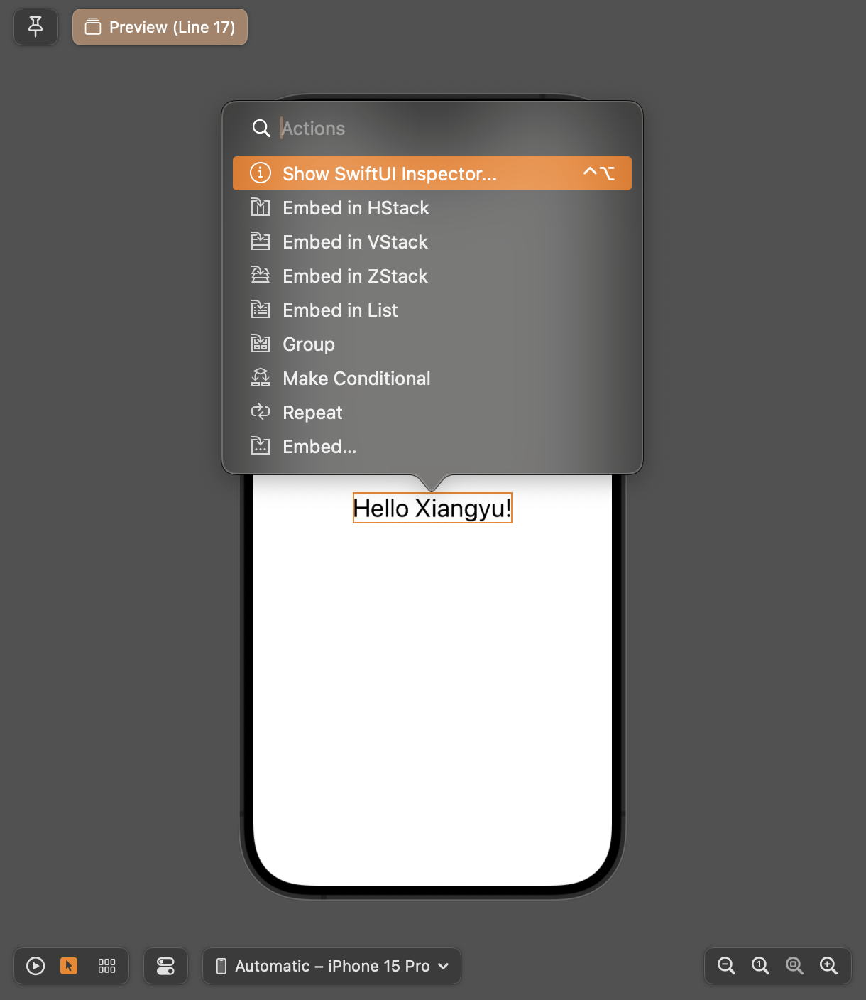
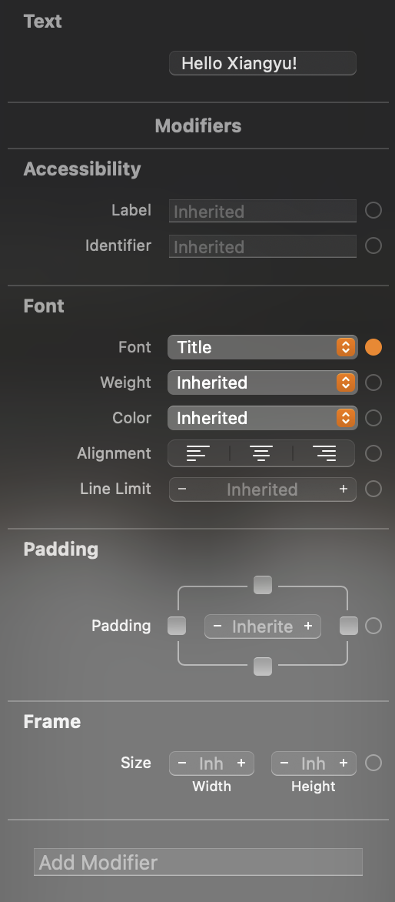
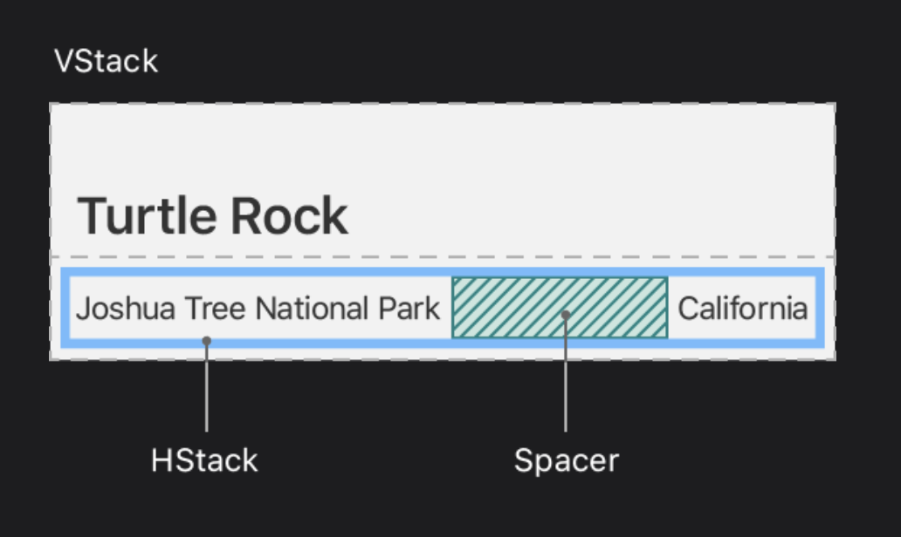
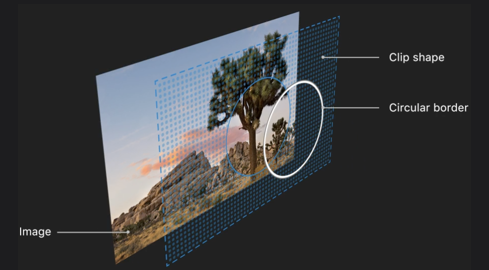
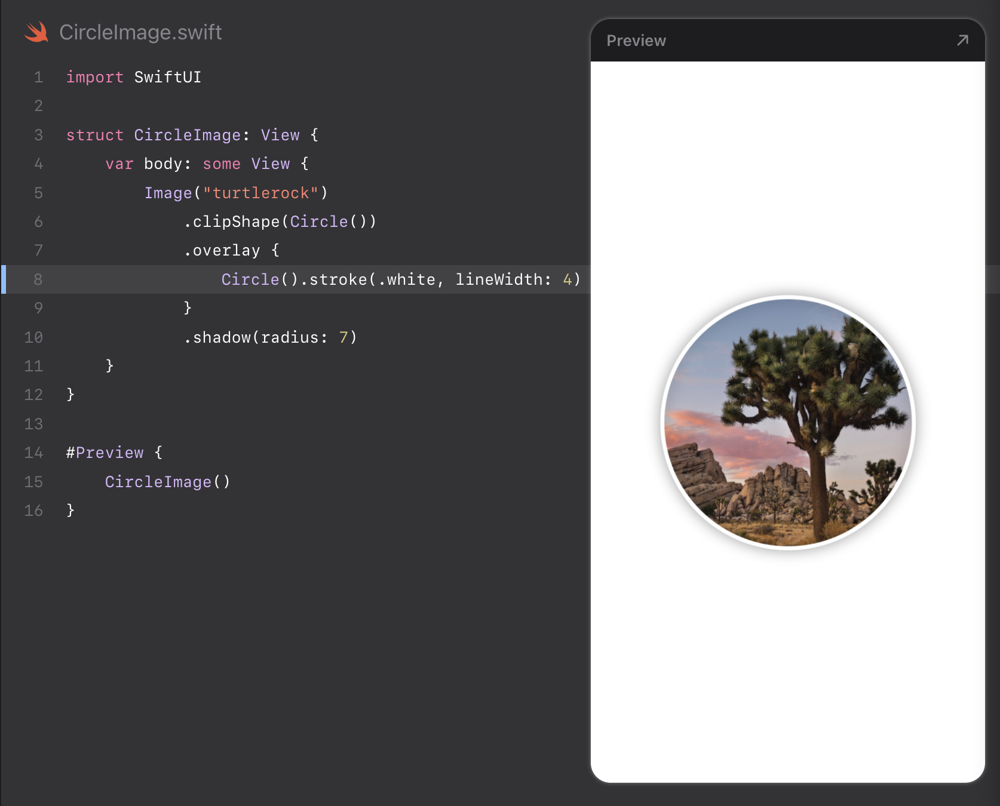
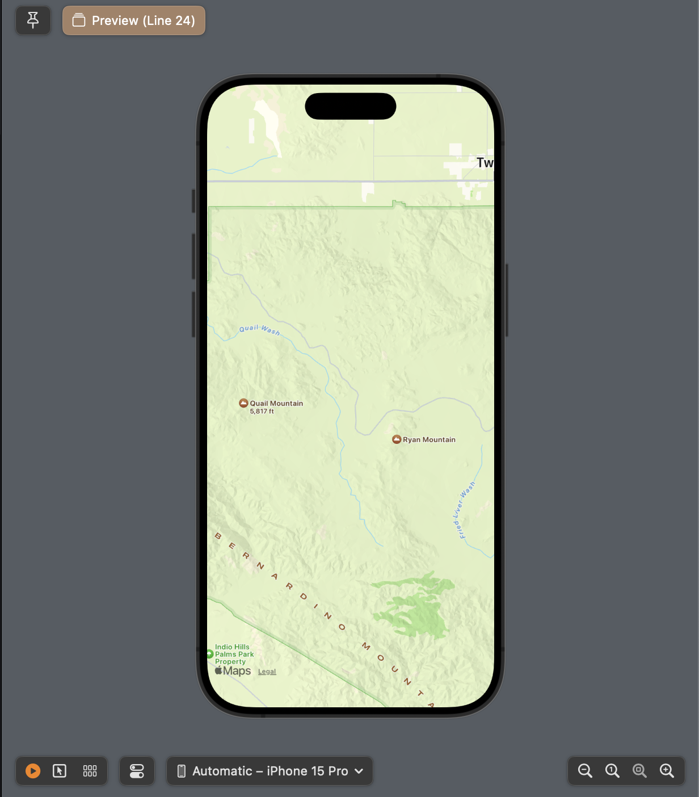
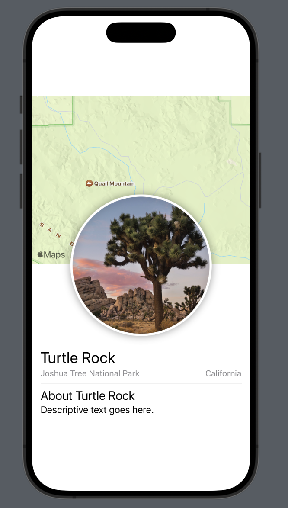
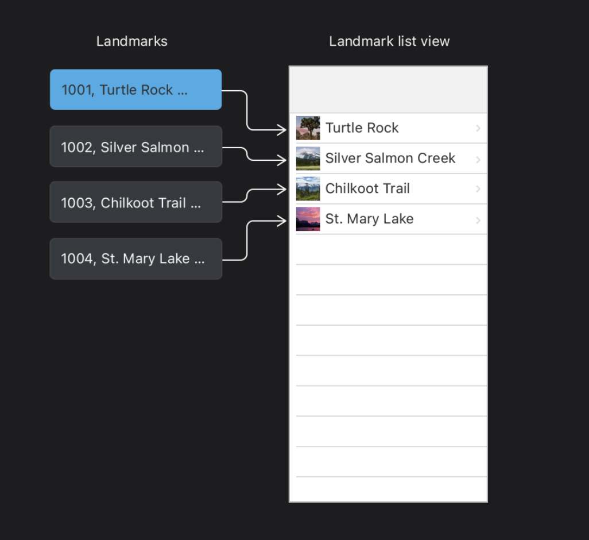

# SwiftUI essentials tutorial

从0开始写一个Demo App

# Creating and combining views

### [Section 1](https://developer.apple.com/tutorials/swiftui/creating-and-combining-views#Create-a-new-project-and-explore-the-canvas) Create a new project and explore the canvas


> Step 5
>
> In the Project navigator, select `ContentView`.
>
> By default, SwiftUI view files declare a structure and a preview. The structure conforms to the `View` protocol and describes the view’s content and layout. The preview declaration creates a preview for that view.


```swift
//
//  LandmarksApp.swift
//  Landmarks
//
//  Created by XIANGYU KONG on 1/28/24.
//

import SwiftUI

// 这里的@main代表一个app's entry point
@main
struct LandmarksApp: App {
    var body: some Scene {
        WindowGroup {
            ContentView()
        }
    }
}


// ContentView.swift

import SwiftUI

struct ContentView: View {
    var body: some View {
        VStack {
            Image(systemName: "globe")
                .imageScale(.large)
                .foregroundStyle(.tint)
            Text("Hello, world!")
        }
        .padding()
    }
}

#Preview {
    ContentView()
}

```


Command + Alt + Enter: 是否展示Canvas的快捷键


### [Section 2](https://developer.apple.com/tutorials/swiftui/creating-and-combining-views#Customize-the-text-view) Customize the text view

Canvas中可以有不同的mode 


在Selectable 模式下按住Command + Ctrl 同时点击Text 文字可以弹出编辑框进行操作 在Live mode 不好用





进行Text相关property的修改




### [Section 3](https://developer.apple.com/tutorials/swiftui/creating-and-combining-views#Combine-views-using-stacks) Combine views using stacks

> When creating a SwiftUI view, you describe its content, layout, and behavior in the view’s `body` property; however, the `body` property only returns a single view. You can combine and embed multiple views in *stacks*, which group views together horizontally, vertically, or back-to-front.




> Step 8
>
> To direct the layout to use the full width of the device, separate the park and the state by adding a `Spacer` to the horizontal stack holding the two text views.
>
> A *spacer* expands to make its containing view use all of the space of its parent view, instead of having its size defined only by its contents.


```swift
import SwiftUI

struct ContentView: View {
    var body: some View {
        VStack(alignment: .leading) {
            Text("Turtle Rock")
                .font(.title)
            HStack {
                Text("Joshua Tree National Park")
                    .font(.subheadline)
                Spacer()
                Text("California")
                    .font(.subheadline)
            }
        }
        .padding()
    }
}

#Preview {
    ContentView()
}
```


### [Section 4](https://developer.apple.com/tutorials/swiftui/creating-and-combining-views#Create-a-custom-image-view) Create a custom image view

给Image View增加自定义属性

图片命名的  1x、2x、3x 这些标记时，我们实际上是在讨论图片的分辨率与设备像素比（Device Pixel Ratio，DPR) 

**2x 图片**: 这是高分辨率图片，适用于 Retina 显示器，其设备像素比为 2。这意味着屏幕上的每个“逻辑”像素实际上由 2x2 个“物理”像素组成。所以，如果你有一个在屏幕上显示为 50x50 像素的图标，它的 2x 版本应该是 100x100 像素的实际图片


在开发中，通常会为每个图像资源提供这三种分辨率的版本，然后根据运行应用的设备选择合适的版本。SwiftUI 和 iOS 会自动根据设备的屏幕特性选择合适的图片版本，开发者只需确保在项目中正确地组织和命名这些图片资源。








```swift
//
//  CircleImage.swift
//  Landmarks
//
//  Created by XIANGYU KONG on 1/28/24.
//

import SwiftUI

struct CircleImage: View {
    var body: some View {
        Image("turtlerock")
            .clipShape(/*@START_MENU_TOKEN@*/Circle()/*@END_MENU_TOKEN@*/)
            .overlay{
                Circle().stroke(.white, lineWidth: 4)
            }
            .shadow(radius: 7)
    }
}

#Preview {
    CircleImage()
}
```


### [Section 5](https://developer.apple.com/tutorials/swiftui/creating-and-combining-views#Use-SwiftUI-views-from-other-frameworks) Use SwiftUI views from other frameworks


使用Map Kit当中的 Map view

有了横纵坐标直接新建一个Map View即可


```swift
import SwiftUI
import MapKit

struct MapView: View {
    var body: some View {
        Map(initialPosition: .region(region))
    }
    
    private var region: MKCoordinateRegion {
        MKCoordinateRegion(
                    center: CLLocationCoordinate2D(latitude: 34.011_286, longitude: -116.166_868),
                    span: MKCoordinateSpan(latitudeDelta: 0.2, longitudeDelta: 0.2)
                )
    }
}

#Preview {
    MapView()
}

```





### [Section 6](https://developer.apple.com/tutorials/swiftui/creating-and-combining-views#Compose-the-detail-view) Compose the detail view


使用`.offset()` 来进行图片位置的变化可以制造叠加效果





```swift
//
//  ContentView.swift
//  Landmarks
//
//  Created by XIANGYU KONG on 1/28/24.
//

import SwiftUI

struct ContentView: View {
    var body: some View {
        VStack {
            MapView()
                .frame(height: 300)
            
            CircleImage()
                .offset(y: -130)
                .padding(.bottom, -130)
            
            VStack(alignment: .leading) {
                Text("Turtle Rock")
                    .font(.title)
                HStack {
                    Text("Joshua Tree National Park")
                    Spacer()
                    Text("California")
                }
                // 这里的font 直接可以应用到HStack之中的两个Text 
                .font(.subheadline)
                .foregroundStyle(.secondary)
                
                Divider()
                Text("About Turtle Rock")
                    .font(.title2)
                Text("Descriptive text goes here.")
            }
            .padding()
        }
    }
}

#Preview {
    ContentView()
}

```


# Building lists and navigation


### [Section 1](https://developer.apple.com/tutorials/swiftui/building-lists-and-navigation#Create-a-landmark-model) Create a landmark model


> Step 3
>
> Define a `Landmark` structure with a few properties matching names of some of the keys in the `landmarkData` data file.
>
> Adding `Codable` conformance makes it easier to move data between the structure and a data file. You’ll rely on the `Decodable` component of the `Codable` protocol later in this section to read data from file.


地点的图 + 问字 + 地点坐标


### [Section 2](https://developer.apple.com/tutorials/swiftui/building-lists-and-navigation#Create-the-row-view) Create the row view


create a new instance


### [Section 3](https://developer.apple.com/tutorials/swiftui/building-lists-and-navigation#Customize-the-row-preview) Customize the row preview

Goal: 如何添加一个List 

动态展示? 


```swift
import SwiftUI


struct LandmarkRow: View {
    var landmark: Landmark


    var body: some View {
        HStack {
            landmark.image
                .resizable()
                .frame(width: 50, height: 50)
            Text(landmark.name)


            Spacer()
        }
    }
}


#Preview {
    // 简单一个Group就能做List展示了
    Group {
        LandmarkRow(landmark: landmarks[0])
        LandmarkRow(landmark: landmarks[1])
    }
}
```


### [Section 5](https://developer.apple.com/tutorials/swiftui/building-lists-and-navigation#Make-the-list-dynamic) Make the list dynamic

Instead of specifying a list’s elements individually, you can generate rows directly from a collection.

You can create a list that displays the elements of a collection by passing your collection of data and a closure that provides a view for each element in the collection. The list transforms each element in the collection into a child view by using the supplied closure.



> Step 1
>
> Remove the two static landmark rows, and instead pass the model data’s `landmarks` array to the `List` initializer.
>
> Lists work with *identifiable* data. You can make your data identifiable in one of two ways: by passing along with your data a key path to a property that uniquely identifies each element, or by making your data type conform to the `Identifiable` protocol.


这里需要用id 作区分

两种方式

1. 遍历的时候就直接加个 id标记 `List(landmarks, id: \.id) { landmark in`
2. 直接在Landmark中 写明Identifiable 


`NavigationSplitView`

`NavigationLink`


添加动态的List


## Handling user input

> In the Landmarks app, a user can flag their favorite places, and filter the list to show just their favorites. To create this feature, you’ll start by adding a switch to the list so users can focus on just their favorites, and then you’ll add a star-shaped button that a user taps to flag a landmark as a favorite.


Goal:

* 添加Favorite button 星星来做标记
* 添加一个Toggle进行一键切换 只展示Favorite

### [Section 1](https://developer.apple.com/tutorials/swiftui/handling-user-input#Mark-favorite-landmarks) Mark favorite landmarks

知识点:

注意: 这里的isFavorite是原来json数据中自带的变量 和user input没任何关系 都是hardcode


> Step 2
>
> Add an `isFavorite` property to the `Landmark` structure.
>
> The `landmarkData` file has a key with this name for each landmark. Because `Landmark` conforms to `Codable`, you can read the value associated with the key by creating a new property with the same name as the key.

```swift
struct Landmark: Hashable, Codable, Identifiable {
    var id: Int
    var name: String
    var park: String
    var state: String
    var description: String
    var isFavorite: Bool  // 这里的isFavorite直接和json文件的key相对应 遵守Codable协议的默认操作

		// ...
}
```


```json
 {
        "name": "Turtle Rock",
        "category": "Rivers",
        "city": "Twentynine Palms",
        "state": "California",
        "id": 1001,
        "isFeatured": true,
        "isFavorite": true,  // 直接定义相同名字的key 就能直接读了
        "park": "Joshua Tree National Park",
        "coordinates": {
            "longitude": -116.166868,
            "latitude": 34.011286
        },
        "description": ...
 }
```


还是要根据data来看 原来的data source当中已经包含了isFavorite 所以可以直接通过定义相同的key name 来直接拿value


### [Section 2](https://developer.apple.com/tutorials/swiftui/handling-user-input#Filter-the-list-view) Filter the list view

配方: 先定义一个state -> 用filter function做数组筛选 -> 在View中使用filteredLandmarks

 

需要通过state来进行管理? 什么意思

> You can customize the list view so that it shows all of the landmarks, or just the user’s favorites. To do this, you’ll need to add a bit of *state* to the `LandmarkList` type.
>
> *State* is a value, or a set of values, that can change over time, and that affects a view’s behavior, content, or layout. You use a property with the `@State` attribute to add state to a view.


就是你要不要选择只展示Favorites的意思??


> Step 2
>
> Add a `@State` property called `showFavoritesOnly` with its initial value set to `false`.
>
> Because you use state properties to hold information that’s specific to a view and its subviews, you always create state as `private`.


```swift

@State private var showFavoritesOnly = false

// 用两个变量来同时控制 showFavoritesOnly和一个Toggle view绑定
var filteredLandmarks: [Landmark] {
      landmarks.filter {
          landmark in (!showFavoritesOnly || landmark.isFavorite)
      }
  }
```


### [Section 3](https://developer.apple.com/tutorials/swiftui/handling-user-input#Add-a-control-to-toggle-the-state) Add a control to toggle the state

> 导读: 
> To give the user control over the list’s filter, you need to add a control that can alter the value of `showFavoritesOnly`. You do this by passing a binding to a toggle control.
>
> A *binding* acts as a reference to a mutable state. When a user taps the toggle from off to on, and off again, the control uses the binding to update the view’s state accordingly.

知识点: 如何将view和某个变量进行绑定? 直接一个 `$` 绑定变量即可

> GPT: 
>
> **isOn: $showFavoritesOnly**:
>
> - `isOn` 参数是一个双向绑定（由 `$` 符号表示），用于控制开关的状态。这里它绑定到了一个名为 `showFavoritesOnly` 的状态变量上。这意味着当用户操作Toggle时，`showFavoritesOnly` 的值将改变（true或false），反之，如果`showFavoritesOnly`的值在代码中被改变，Toggle的显示状态也会相应更新。
> - 这种双向绑定是SwiftUI响应式编程的一个重要特性，它允许UI组件与数据状态保持同步。


配方: 先用`ForEach` 包裹要嵌套的List这样才能分组 -> 加一个Toggle View并绑定相对应的变量


> To give the user control over the list’s filter, you need to add a control that can alter the value of `showFavoritesOnly`. You do this by passing a binding to a toggle control.
>
> A *binding* acts as a reference to a mutable state. When a user taps the toggle from off to on, and off again, the control uses the binding to update the view’s state accordingly.


对于数据源有多个的场景，使用`ForEach` 更灵活


```swift
//
//  LandmarkList.swift
//  Landmarks
//
//  Created by XIANGYU KONG on 1/28/24.
//

import SwiftUI

struct LandmarkList: View {
    @State private var showFavoritesOnly = false
    
    var filteredLandmarks: [Landmark] {
        landmarks.filter {
            landmark in (!showFavoritesOnly || landmark.isFavorite)
        }
    }
    var body: some View {
        NavigationSplitView {
            List {
                Toggle(isOn: $showFavoritesOnly) {
                    Text("Favorites Only")
                }
                
                ForEach(filteredLandmarks) { landmark in
                    NavigationLink {
                        LandmarkDetail(landmark: landmark)
                    } label: {
                        LandmarkRow(landmark: landmark)
                    }
                }
            }
            .navigationTitle("Landmarks")
        } detail: {
            Text("Select a Landmark")
        }
    }
}

#Preview {
    LandmarkList()
}
```


### [Section 4](https://developer.apple.com/tutorials/swiftui/handling-user-input#Use-observation-for-storage) Use observation for storage

>导读:
>
>To prepare for the user to control which particular landmarks are favorites, you’ll first store the landmark data using the `Observable()` macro.
>
>With Observation, a view in SwiftUI can support data changes without using property wrappers or bindings. SwiftUI watches for any observable property changes that could affect a view, and displays the correct version of the view after a change.


没看懂这个Observable 是在干嘛?   是为了持续关注landmarks 里面的所有data 吗? 


### [Section 5](https://developer.apple.com/tutorials/swiftui/handling-user-input#Adopt-the-model-object-in-your-views) Adopt the model object in your views

知识点: `@Environment` 是干嘛的?  pass the data object down through the environment ? 

貌似是有一个data store的概念在里面? 


整个就是为了把 @Environment 变量放到各个地方 


没太理解Environment是干嘛的 先放那了 后面再回来看


### [Section 6](https://developer.apple.com/tutorials/swiftui/handling-user-input#Create-a-favorite-button-for-each-landmark) Create a favorite button for each landmark


加一个Favorite button 来让用户标记出来自己Favorite 地标


`@Binding`


读装饰器设计模式 经常出现


> Step 2
>
> Add an `isSet` binding that indicates the button’s current state, and provide a constant value for the preview.
>
> The binding property wrapper enables you to read and write between a property that stores data and a view that displays and changes the data. Because you use a binding, changes made inside this view propagate back to the data source.


为啥要加index ?  方便后面做定位


其实整个项目并没有完全看懂


# Drawing paths and shapes


没太大兴趣 先跳过


## Composing complex interfaces 


### [Section 1](https://developer.apple.com/tutorials/swiftui/composing-complex-interfaces#Add-a-category-view) Add a category view


如果需要跳转肯定是要有NavigationSplitView + NavigationLink的


### [Section 2](https://developer.apple.com/tutorials/swiftui/composing-complex-interfaces#Create-a-category-list) Create a category list

横向的List如何进行管理? 


还是相同的数据集 但是不同的展示方式 一鱼多吃 而且如何有机的展示信息也是很考验UI设计功底的事情


字典里面直接有集合


> Step 1
>
> In `Landmark`, add a `Category` enumeration and a `category` property to the `Landmark` structure.
>
> The `landmarkData` file already includes a `category` value for each landmark with one of three string values. By matching the names in the data file, you can rely on the structure’s `Codable` conformance to load the data.


category 累别的数据是已经有了的 但是直接使用Dictionary来用自己定义的会更直接一点


modelData property是什么意思?  


` ScrollView(.horizontal,` 竖排滑动展示 


用来强制解包 提取元素

`!`: 在Swift中，`!`（感叹号）是一个强制解包操作符。当它用在一个可选类型（Optional）后面时，它的作用是强制从这个可选类型中取出其包含的值。


### [Section 4](https://developer.apple.com/tutorials/swiftui/composing-complex-interfaces#Complete-the-category-view) Complete the category view


### [Section 5](https://developer.apple.com/tutorials/swiftui/composing-complex-interfaces#Add-navigation-between-sections) Add navigation between sections


> With all of the differently categorized landmarks visible in the view, the user needs a way to reach each section in the app. Use the navigation and presentation APIs to make the category home, the detail view, and favorites list navigable from a tab view.


