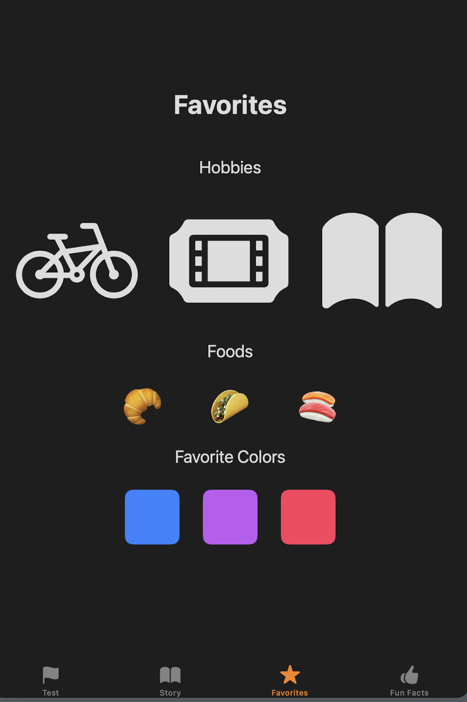

# Sample Apps Tutorial - Apple Developer 


100 Days of Swift

https://www.hackingwithswift.com/100/swiftui

# Navigation 


## 


Swift UI doc: https://developer.apple.com/documentation/swiftui

Learning SwiftUI: https://developer.apple.com/tutorials/swiftui-concepts


## [About Me](https://developer.apple.com/tutorials/sample-apps/aboutme)


Goal:

* display information across multiple tab views.
* how to show data


### Section 1 Tabbed Interface


**ContentView**


Swift UI 中有很多重名的类, 这里用到的[TabView](https://developer.apple.com/documentation/swiftui/tabview/)是在Navigation中的

`TabView`: create a user interface with tabs

>Step 3
>
>[TabView](https://developer.apple.com/documentation/SwiftUI/TabView) is how you create a user interface with tabs. Inside the tab view, you list each of the tab items that you want.


`Label`: icon + title  一个`String` + 一个`systemImage`

* `systemImage` 中的name是用的 [SF Symbols](https://developer.apple.com/sf-symbols/) 可以下载一个软件来找自己需要的图标名称

>Step 7
>
>The `tabItem` modifier only accepts [Label](https://developer.apple.com/documentation/SwiftUI/Label), [Text](https://developer.apple.com/documentation/SwiftUI/Text), and [Image](https://developer.apple.com/documentation/SwiftUI/Image) views. Including any other type of view, such as [Button](https://developer.apple.com/documentation/SwiftUI/Button), results in an empty tab item.


```swift
/*
See the License.txt file for this sample’s licensing information.
*/

import SwiftUI

struct ContentView: View {
    var body: some View {
        TabView {
            // 这里的View需要在当前的文件夹中存在 
            HomeView()
                .tabItem {
                    Label("Home", systemImage: "person")
                }
            
            StoryView()
                .tabItem {
                    Label("Story", systemImage: "book")
                }
            
            FavoritesView()
                .tabItem {
                    Label("Favorites", systemImage: "star")
                }
            
            FunFactsView()
                .tabItem {
                    Label("Fun Facts", systemImage: "hand.thumbsup")
                }
        }
        
    }
}

struct ContentView_Previews: PreviewProvider {
    static var previews: some View {
        ContentView()
    }
}

```


### Section 2 Your Data

> Step 1
>
> This file is where your app stores all of its data (information). In SwiftUI, it’s best to keep the data separate from the visual components of your app. While learning SwiftUI, you’ll frequently see the concept of having a “source of truth” for your data, which means that you only define a value in one place. 


```swift
/*
See the License.txt file for this sample’s licensing information.
*/

import Foundation
import SwiftUI

struct Info {
    let image: String
    let name: String
    let story: String
    let hobbies: [String]
    let foods: [String]
    let colors: [Color]
    let funFacts: [String]
}

let information = Info(
    image: "Placeholder",
    name: "Xiangyu Kong",
    story: "A story can be about anything you can dream up. There are no right answers, there is no one else.\n\nNeed some inspiration?\n• 🐶🐱🛶️🎭🎤🎧🎸\n• 🏄‍♀️🚵‍♀️🚴‍♀️⛵️🥾🏂⛷📚\n• ✍️🥖☕️🏋️‍♂️🚲🧗‍♀️ ",
    hobbies: ["bicycle", "ticket.fill", "book.fill"],
    foods: ["🥐", "🌮", "🍣"],
    colors: [Color.blue, Color.purple, Color.pink],
    funFacts: [
        "The femur is the longest and largest bone in the human body.",
        "The moon is 238,900 miles away.",
        "Prince’s last name was Nelson.",
        "503 new species were discovered in 2020.",
        "Ice is 9 percent less dense than liquid water.",
        "You can spell every number up to 1,000 without using the letter A.\n\n...one, two, three, four...ninety-nine...nine hundred ninety-nine 🧐",
        "A collection of hippos is called a bloat.",
        "White sand beaches are made of parrotfish poop.",
    ]
)

```


### Section 3 Home Tab


`HomeView` 第一个View上来默认直接展示

`Vstack`是竖排结构 from 

> Step 2 
>
> A [VStack](https://developer.apple.com/documentation/SwiftUI/VStack) organizes its contents vertically from top to bottom on the screen.


Text + Image + Text

> Step 3
>
> A [Text](https://developer.apple.com/documentation/SwiftUI/Text) view displays the string inside the quotation marks.


> Step 9
>
> This [Image](https://developer.apple.com/documentation/SwiftUI/Image) view displays the image that you changed in the `Data` file.


`Image` view 当中的 `.resizable` 是一个重要的property

>Step 11
>
>It allows the image to adapt to the available space on the screen; otherwise the image appears at its full size, which may be very large.

Q: 大部分样式可以直接从组件库里面拿? 在哪里能够看到不同setting的效果呢? 直接改代码看效果? 

```swift
// HomeView
/*
See the License.txt file for this sample’s licensing information.
*/

import SwiftUI

struct HomeView: View {
    var body: some View {
        VStack {
            Text("All About")
                .font(.largeTitle)
                .fontWeight(.bold)
                .padding()

            Image(information.image) // information 是在Data文件中定义的 
                .resizable()
                .aspectRatio(contentMode: .fit)
                .cornerRadius(10)
                .padding(40)

            Text(information.name)
                .font(.title)
        }
    }
}

struct HomeView_Previews: PreviewProvider {
    static var previews: some View {
        HomeView()
    }
}
```


### Section 4 Story Tab


+ 

语法点

* `ScrollView` 


>Step 2
>
>To let your story scroll if the text gets too long, wrap your `Text` view in a [ScrollView](https://developer.apple.com/documentation/SwiftUI/ScrollView).


```swift
/* StoryView */

import SwiftUI

struct StoryView: View {
    var body: some View {
        VStack {
            Text("My Story")
                .font(.largeTitle)
                .fontWeight(.bold)
                .padding()
            
            ScrollView {
                Text(information.story)
                    .font(.body)
                    .padding()
            }
        }
        .padding([.top, .bottom], 50)
    }
}

struct StoryView_Previews: PreviewProvider {
    static var previews: some View {
        StoryView()
    }
}

```


### Section 5 Favorites Tab

语法点

* `ForEach` 
* `HStack` 横屏的View 


```swift
/*
FavoritesView
*/

import SwiftUI

struct FavoritesView: View {
    var body: some View {
        VStack {
            Text("Favorites")
                .font(.largeTitle)
                .fontWeight(.bold)
                .padding(.bottom, 40)
            
            Text("Hobbies")
                .font(.title2)
            
            
            HStack {
              // 这里的hobby 其实也是systemName的图标名称 
              // in: 这个关键字在闭包中用来分隔参数和闭包的主体。
              // 它前面的部分定义了输入（在这个例子中是每个 hobby），in 后面的代码块定义了对每个输入元素要执行的操作。
                ForEach(information.hobbies, id: \.self) { hobby in
                    Image(systemName: hobby)
                        .resizable()
                        .frame(maxWidth: 80, maxHeight: 60)
                    
                }
                .padding()
            }
            .padding()

            Text("Foods")
                .font(.title2)
            
            HStack(spacing: 60) {
                ForEach(information.foods, id: \.self) { food in
                    Text(food)
                        .font(.system(size: 48))
                }
            }
            .padding()

            Text("Favorite Colors")
                .font(.title2)

            HStack(spacing: 30) {
                ForEach(information.colors, id: \.self) { color in
                    color
                        .frame(width: 70, height: 70)
                        .cornerRadius(10)
                }
            }
            .padding()
        }
    }
}

struct FavoritesView_Previews: PreviewProvider {
    static var previews: some View {
        FavoritesView()
    }
}

```





### Section 6 Fun Facts Tab

**语法点**

* `Button` 按钮


```swift
/*
FunFactView
*/

import SwiftUI

struct FunFactsView: View {

    @State private var funFact = ""
    var body: some View {
        VStack {
            Text("Fun Facts")
                .font(.largeTitle)
                .fontWeight(.bold)
            
            // funFact是一个自定义的变量在这展示 在Button之中定义(关联)
            Text(funFact)
                .padding()
                .font(.title)
                .frame(minHeight: 400)

            Button("Show Random Fact") {
                funFact = information.funFacts.randomElement()!
            }
        }
        .padding()
    }
}

struct FunFactsView_Previews: PreviewProvider {
    static var previews: some View {
        FunFactsView()
    }
}

```


