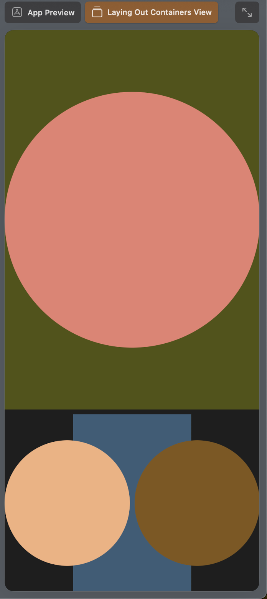
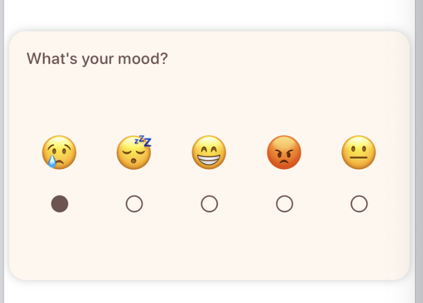

# Sample Apps Tutorial - Apple Developer 


100 Days of Swift

https://www.hackingwithswift.com/100/swiftui

# Navigation 


Swift UI doc: https://developer.apple.com/documentation/swiftui

Learning SwiftUI: https://developer.apple.com/tutorials/swiftui-concepts


## [About Me](https://developer.apple.com/tutorials/sample-apps/aboutme)


Goal:

* display information across multiple tab views.
* how to show data


### Section 1 Tabbed Interface


**ContentView**


Swift UI 中有很多重名的类, 这里用到的[TabView](https://developer.apple.com/documentation/swiftui/tabview/)是在Navigation中的

`TabView`: create a user interface with tabs

>Step 3
>
>[TabView](https://developer.apple.com/documentation/SwiftUI/TabView) is how you create a user interface with tabs. Inside the tab view, you list each of the tab items that you want.


`Label`: icon + title  一个`String` + 一个`systemImage`

* `systemImage` 中的name是用的 [SF Symbols](https://developer.apple.com/sf-symbols/) 可以下载一个软件来找自己需要的图标名称

>Step 7
>
>The `tabItem` modifier only accepts [Label](https://developer.apple.com/documentation/SwiftUI/Label), [Text](https://developer.apple.com/documentation/SwiftUI/Text), and [Image](https://developer.apple.com/documentation/SwiftUI/Image) views. Including any other type of view, such as [Button](https://developer.apple.com/documentation/SwiftUI/Button), results in an empty tab item.


```swift
/*
See the License.txt file for this sample’s licensing information.
*/

import SwiftUI

struct ContentView: View {
    var body: some View {
        TabView {
            // 这里的View需要在当前的文件夹中存在 
            HomeView()
                .tabItem {
                    Label("Home", systemImage: "person")
                }
            
            StoryView()
                .tabItem {
                    Label("Story", systemImage: "book")
                }
            
            FavoritesView()
                .tabItem {
                    Label("Favorites", systemImage: "star")
                }
            
            FunFactsView()
                .tabItem {
                    Label("Fun Facts", systemImage: "hand.thumbsup")
                }
        }
        
    }
}

struct ContentView_Previews: PreviewProvider {
    static var previews: some View {
        ContentView()
    }
}

```


### Section 2 Your Data

> Step 1
>
> This file is where your app stores all of its data (information). In SwiftUI, it’s best to keep the data separate from the visual components of your app. While learning SwiftUI, you’ll frequently see the concept of having a “source of truth” for your data, which means that you only define a value in one place. 


```swift
/*
See the License.txt file for this sample’s licensing information.
*/

import Foundation
import SwiftUI

struct Info {
    let image: String
    let name: String
    let story: String
    let hobbies: [String]
    let foods: [String]
    let colors: [Color]
    let funFacts: [String]
}

let information = Info(
    image: "Placeholder",
    name: "Xiangyu Kong",
    story: "A story can be about anything you can dream up. There are no right answers, there is no one else.\n\nNeed some inspiration?\n• 🐶🐱🛶️🎭🎤🎧🎸\n• 🏄‍♀️🚵‍♀️🚴‍♀️⛵️🥾🏂⛷📚\n• ✍️🥖☕️🏋️‍♂️🚲🧗‍♀️ ",
    hobbies: ["bicycle", "ticket.fill", "book.fill"],
    foods: ["🥐", "🌮", "🍣"],
    colors: [Color.blue, Color.purple, Color.pink],
    funFacts: [
        "The femur is the longest and largest bone in the human body.",
        "The moon is 238,900 miles away.",
        "Prince’s last name was Nelson.",
        "503 new species were discovered in 2020.",
        "Ice is 9 percent less dense than liquid water.",
        "You can spell every number up to 1,000 without using the letter A.\n\n...one, two, three, four...ninety-nine...nine hundred ninety-nine 🧐",
        "A collection of hippos is called a bloat.",
        "White sand beaches are made of parrotfish poop.",
    ]
)

```


### Section 3 Home Tab


`HomeView` 第一个View上来默认直接展示

`Vstack`是竖排结构 from 

> Step 2 
>
> A [VStack](https://developer.apple.com/documentation/SwiftUI/VStack) organizes its contents vertically from top to bottom on the screen.


Text + Image + Text

> Step 3
>
> A [Text](https://developer.apple.com/documentation/SwiftUI/Text) view displays the string inside the quotation marks.


> Step 9
>
> This [Image](https://developer.apple.com/documentation/SwiftUI/Image) view displays the image that you changed in the `Data` file.


`Image` view 当中的 `.resizable` 是一个重要的property

>Step 11
>
>It allows the image to adapt to the available space on the screen; otherwise the image appears at its full size, which may be very large.

Q: 大部分样式可以直接从组件库里面拿? 在哪里能够看到不同setting的效果呢? 直接改代码看效果? 

```swift
// HomeView
/*
See the License.txt file for this sample’s licensing information.
*/

import SwiftUI

struct HomeView: View {
    var body: some View {
        VStack {
            Text("All About")
                .font(.largeTitle)
                .fontWeight(.bold)
                .padding()

            Image(information.image) // information 是在Data文件中定义的 
                .resizable()
                .aspectRatio(contentMode: .fit)
                .cornerRadius(10)
                .padding(40)

            Text(information.name)
                .font(.title)
        }
    }
}

struct HomeView_Previews: PreviewProvider {
    static var previews: some View {
        HomeView()
    }
}
```


### Section 4 Story Tab

语法点

* `ScrollView` 


>Step 2
>
>To let your story scroll if the text gets too long, wrap your `Text` view in a [ScrollView](https://developer.apple.com/documentation/SwiftUI/ScrollView).


```swift
/* StoryView */

import SwiftUI

struct StoryView: View {
    var body: some View {
        VStack {
            Text("My Story")
                .font(.largeTitle)
                .fontWeight(.bold)
                .padding()
            
            ScrollView {
                Text(information.story)
                    .font(.body)
                    .padding()
            }
        }
        .padding([.top, .bottom], 50)
    }
}

struct StoryView_Previews: PreviewProvider {
    static var previews: some View {
        StoryView()
    }
}

```


### Section 5 Favorites Tab

语法点

* `ForEach` 
* `HStack` 横屏的View 


```swift
/*
FavoritesView
*/

import SwiftUI

struct FavoritesView: View {
    var body: some View {
        VStack {
            Text("Favorites")
                .font(.largeTitle)
                .fontWeight(.bold)
                .padding(.bottom, 40)
            
            Text("Hobbies")
                .font(.title2)
            
            
            HStack {
              // 这里的hobby 其实也是systemName的图标名称 
              // in: 这个关键字在闭包中用来分隔参数和闭包的主体。
              // 它前面的部分定义了输入（在这个例子中是每个 hobby），in 后面的代码块定义了对每个输入元素要执行的操作。
                ForEach(information.hobbies, id: \.self) { hobby in
                    Image(systemName: hobby)
                        .resizable()
                        .frame(maxWidth: 80, maxHeight: 60)
                    
                }
                .padding()
            }
            .padding()

            Text("Foods")
                .font(.title2)
            
            HStack(spacing: 60) {
                ForEach(information.foods, id: \.self) { food in
                    Text(food)
                        .font(.system(size: 48))
                }
            }
            .padding()

            Text("Favorite Colors")
                .font(.title2)

            HStack(spacing: 30) {
                ForEach(information.colors, id: \.self) { color in
                    color
                        .frame(width: 70, height: 70)
                        .cornerRadius(10)
                }
            }
            .padding()
        }
    }
}

struct FavoritesView_Previews: PreviewProvider {
    static var previews: some View {
        FavoritesView()
    }
}

```


### Section 6 Fun Facts Tab

**语法点**

* `Button` 按钮

```swift
/*
FunFactView
*/

import SwiftUI

struct FunFactsView: View {

    @State private var funFact = ""
    var body: some View {
        VStack {
            Text("Fun Facts")
                .font(.largeTitle)
                .fontWeight(.bold)
            
            // funFact是一个自定义的变量在这展示 在Button之中定义(关联)
            Text(funFact)
                .padding()
                .font(.title)
                .frame(minHeight: 400)

            Button("Show Random Fact") {
                funFact = information.funFacts.randomElement()!
            }
        }
        .padding()
    }
}

struct FunFactsView_Previews: PreviewProvider {
    static var previews: some View {
        FunFactsView()
    }
}

```


# Presenting Content


## [Edit Grids](https://developer.apple.com/tutorials/sample-apps/editinggrids)

目前没有需求

### Section 1 Creating the Navigation for Your App

> Explore how to add navigation to your app using a [NavigationStack](https://developer.apple.com/documentation/SwiftUI/NavigationStack).


### Section 2 Defining an Identifiable Type

> Learn how to create data that is uniquely identifiable in SwiftUI.


### Section 3 Creating a Symbol

> Learn how to create an image view using an [SF Symbol](https://developer.apple.com/sf-symbols/).


### Section 4 Building the Navigation Grid

> Create a grid of SF Symbols from an array of `Symbol` values.


### Section 5 Adding an Editing Mode

> Explore how to add editing functionality to your grid, including the ability to add or delete items.


这里add or delete 是在本地进行存储的么?


## Laying Out Views


这个项目的复杂度有点高啊 

给出的Demo文件 和教程中的内容不一致 Demo是一个日记本 Journal 

而Tutorials中提到的文件其实都是

各种Folder中的文件都是干嘛用的

如何快速


Organize, size and align view layouts.


When creating an app, one of the first skills to learn is how to lay out your user interface, or UI. When laying out a UI, there are three major things you need to do:

- Organize your views in different configurations using container views.
- Fine tune the sizing, spacing, alignment, and positioning of your views.
- Debug your views when something goes wrong.


### [Section 1](https://developer.apple.com/tutorials/sample-apps/layingoutviews#Organize-your-views) Organize your views


默认的形状和大小可以自适应 可以加modifier进行修改

> Step 2
>
> `Shape` views expand to fill the entire space that’s offered by the container view. Because there are two shape views that need to share the space in the `VStack` equally, their sizes adapt accordingly.


根据需要选择不同类型的container

* `VStack` : 上下排列 上

* `HStack`: 水平排列 

* `ZStack`: Z 轴上排列 堆叠效果


> Step 6
>
> There are more containers than just `HStack`, `VStack`, and `ZStack` views. To explore different containers and how to use them to lay out your content, see [Picking container views for your content](https://developer.apple.com/documentation/SwiftUI/Picking-Container-Views-for-Your-Content)

```swift
/*
LayingOutContainersView.swift
*/

import SwiftUI

struct LayingOutContainersView: View {
    var body: some View {
        VStack {
            ZStack {
                Rectangle()
                    .foregroundColor(.themeGreen)
                Circle()
                    .foregroundColor(.themePink)
            }
            ZStack {
                Rectangle()
                    .foregroundColor(.themeBlue)
                    .frame(width: 200, height: 300)
                HStack {
                    Circle()
                        .foregroundColor(.themeRed)
                    Circle()
                        .foregroundColor(.themeOrange)
                }
            }
        }
    }
}

struct LayingOutContainersView_Previews: PreviewProvider {
    static var previews: some View {
        LayingOutContainersView()
    }
}

```





view是一个container 在里面可以放置subviews


### [Section 2](https://developer.apple.com/tutorials/sample-apps/layingoutviews#Modify-and-determine-view-sizes) Modify and determine view sizes

>Step 4
>
>Views are somewhat magical, in that certain view types control how they resize when placed in a container. They can expand to fill the available space, such as `Rectangle` or other [Shape](https://developer.apple.com/documentation/SwiftUI/Shape).


可以使用动态调整

> Step 7
>
> Providing fixed values for the `width` and `height` limits how adaptive the view can be. 🙃
>
> Tip
>
> A better way to do this is to give a maximum, minimum, or ideal width and height for a view. This allows the view to resize as necessary based on how much space is available in the container.


尽可能避免使用`.frame`

> Step 9
>
> Adding a `frame` to an image can sometimes cause it to look stretched even by adding an ideal `width` and `height`. For images, it’s often better to use [`scaledToFill()`](https://developer.apple.com/documentation/SwiftUI/View/scaledToFill()) or doc://com.apple.documentation/documentation/swiftui/menu/scaledtofit() instead of a `frame`.
>
> Tip
>
> Using both can help get a precise size for an image that is not distorted or too large.


### [Section 3](https://developer.apple.com/tutorials/sample-apps/layingoutviews#Refine-the-spacing-and-alignment-of-your-views) Refine the spacing and alignment of your views

对于API的熟悉程度 能不能直接讲样式调整成自己想要的样子

讲解三种不同进行spacing和 alignment的方式

* 直接在View中添加alignment parameter e.g. `VStack(alignment: .leading) `  提问Mark: 这里应该是因为特定类型的View才有alignment property
* 在frame modifier中添加alignment parameter e.g. `.frame(maxWidth: .infinity, alignment: .trailing)`
* 直接使用[Spacer](https://developer.apple.com/documentation/SwiftUI/Spacer) (A flexible space that expands along the major axis of its containing stack layout, or on both axes if not contained in a stack.) ` HStack(spacing: 20) { Spacer()}`


Layout 相关可能需要用


不同类型的Stack 使用的`alignment` 类型是不一致的


>Step 4
>
>In vertical stacks, you can only set the horizontal alignment, like `.leading` or `.trailing`.
>
>Note
>
>In horizontal stacks you can only set the vertical alignment, like `.top` or `.bottom`.


>Adding a `Spacer` inside an `HStack` causes the stack to expand to fill in any remaining horizontal space, and pushes the `Image` view to the `.trailing` edge.

```swift
/* AmazingAlignment.swift */

import SwiftUI

struct AmazingAlignment: View {
    var body: some View {
        VStack(alignment: .leading) {
            Image(systemName: "books.vertical.fill")
                .font(.system(size: 40))
            Rectangle()
                .frame(maxWidth: .infinity, maxHeight: 10)
            VStack (alignment: .trailing){
                // 这里是直接套娃了 在VStack当中嵌套VStack
                Image(systemName: "books.vertical.fill")
                    .font(.system(size: 40))
                    
                Rectangle()
                    .frame(maxWidth: .infinity, maxHeight: 10)
            }
            Image(systemName: "books.vertical.fill")
                .font(.system(size: 40))
                .frame(maxWidth: .infinity, alignment: .trailing)
            Rectangle()
                .frame(maxWidth: .infinity, maxHeight: 10)
            HStack(spacing: 20) {
                Spacer()
                Image(systemName: "books.vertical.fill")
                    .font(.system(size: 40))
                    .background(Color.yellow)
                Image(systemName: "books.vertical.fill")
                    .font(.system(size: 40))
                    .padding(.trailing, 20)
            }
            .background(Color.mint)
            Rectangle()
                .frame(maxWidth: .infinity, maxHeight: 10)
        }
        .padding(.horizontal)
        .frame(width: 250) // 这里的width会直接对上面VStack中的所有view进行调整
        .border(Color.black)
    }
}

// 下面的代码是用来展示Preview的
struct AmazingAlignment_Previews: PreviewProvider {
    static var previews: some View {
        AmazingAlignment()
    }
}
```


### [Section 4](https://developer.apple.com/tutorials/sample-apps/layingoutviews#Debugging-views) Debugging views


两个View的组合嵌套? 

可以将修改和更新同时应用到上下两个Half Card之中


这个Section主要是集中在overlay的使用上


小技巧 在debug View的时候添加border来帮助划清界限

>Step 3
>
>Any code applied to the `HalfCard` view affects both the top and bottom halves of the card, allowing you to fix issues in both halves at the same time.
>
>Tip
>
>Adding a border to a view is a great debugging tool because it allows you to see how much space a view occupies. You can use this technique to diagnose lots of issues in your code.


每加一个modifier都会新建一个View 所以`border`的顺序会有区别

>Step 5
>
>Even though the frame expanded, all of the graphics are still squished together. Add another border above the `frame` modifier. This allows you to see the outline of the `VStack` before you apply the `frame`.
>
>Tip
>
>You might wonder, why would it make a difference if you apply the border before or after the `frame`? This is because you actually produce a new view each time you apply a modifier, so the order that you apply them really matters. See [Configuring views](https://developer.apple.com/documentation/SwiftUI/Configuring-Views) for more on this.


`frame`中添加alignment选项会更灵活，不受到具体View类型的限制

>Step 10
>
>There are two ways to align the crown to the bottom of your `HalfCard` view. You can add the `alignment` parameter to the `frame`– `.frame(maxWidth: .infinity, maxHeight: .infinity, alignment: .bottom)` Or, add a `Spacer` above the crown.


```swift
/*
DebuggingViews.swift
*/

import SwiftUI

struct HalfCard: View {
    var body: some View {
        VStack() {
//            Spacer()
            Image(systemName: "crown.fill")
                .font(.system(size: 180))
        }.frame(maxWidth: /*@START_MENU_TOKEN@*/.infinity/*@END_MENU_TOKEN@*/, maxHeight: .infinity, alignment: .top)
        .border(Color.pink)
        //#-learning-code-snippet(6.debugFrameCorrection)
        .overlay (alignment: .topLeading) {
            VStack {
                Image(systemName: "crown.fill")
                    .font(.body)
                Text("Q")
                    .font(.largeTitle)
                Image(systemName: "heart.fill")
                    .font(.title)
            }
            .padding()
        }
        .border(Color.blue)
        .border(Color.green)
        //#-learning-code-snippet(6.debugFrameQuestion)
        //#-learning-code-snippet(6.debugFrame)
        //#-learning-code-snippet(6.debugBorder)
    }
}

struct DebuggingView: View {
    var body: some View {
        VStack {
            HalfCard()
            HalfCard()
                .rotationEffect(.degrees(180))
        }
        .background(
            RoundedRectangle(cornerRadius: 10)
                .stroke(Color.black)
        )
        .aspectRatio(0.70, contentMode: .fit)
        .foregroundColor(.red)
        .padding()
    }
}

struct DebuggingView_Previews: PreviewProvider {
    static var previews: some View {
        DebuggingView()
    }
}

```


### [Section 5](https://developer.apple.com/tutorials/sample-apps/layingoutviews#Bringing-it-all-together) Bringing it all together





UI美化两个简单的起步:

* 增加 `padding` 给一些空间 
* 修改`maxWidth` 来拉宽 


```swift
/* MoodViewFull.swift */

import SwiftUI


struct MoodViewFull: View {
    @Binding var value: String
    private let emojis = ["😢", "😴", "😁", "😡", "😐"]
    
    var body: some View {
        VStack {
            Text("What's your mood?")
                .foregroundColor(.darkBrown)
                .font(.headline)
                .frame(maxWidth: .infinity, alignment: .leading)
            HStack {
                ForEach(emojis, id: \.self) { emoji in
                    Button {
                        value = emoji
                    } label: {
                        VStack {
                            Text(emoji)
                                .font(.system(size: 35))
                                .frame(maxWidth: .infinity, alignment: .center)
                                .padding(.bottom)
                            Image(systemName: value == emoji ? "circle.fill" : "circle")
                                .font(.system(size: 16))
                                .foregroundColor(.darkBrown)
                        }
                    }
                }
            }
            .frame(maxHeight: .infinity, alignment: .center)
        }
        .frame(minHeight: 100, maxHeight: 200)
        .padding()
    }
}
```


大概知道了一个 具体问题遇到了再回来看就行了


做App这件事对于交互很重要

vision Pro 做真人?  


# Retrieving Content from a Server

## Meme Creator


Follow Up

从db里面拿数据要怎么做?


似乎是用了AsyncImage ? 

如何理解SwiftUI当中的View ? 


### Section 1 Sharing App Data

Explore how the app makes its fetched data available to the entire view hierarchy.


### Concepts

* environment object
* observable object


```swift
import SwiftUI

@main
struct MemeCreatorApp: App {
    @StateObject private var fetcher = PandaCollectionFetcher()
    
    var body: some Scene {
        WindowGroup {
            NavigationStack {
                MemeCreator()
                    .environmentObject(fetcher)
            }
        }
    }
}
```


> Step 1
>
> To fetch its data, the app uses an observable object, `PandaCollectionFetcher`. This is where all of the data fetching occurs.


### [Section 2](https://developer.apple.com/tutorials/sample-apps/memecreator#Creating-the-Panda-Model) Creating the Panda Model

**Concepts**

* `Codable`: `Decodable` 和 `Encodable`的组合


这里的data model 也是base 在json file 


>Step 3
>
>A `PandaCollection` is composed of an array of `Panda` model objects. This mirrors the format of the JSON data, which enables you to easily decode URLs and descriptive text from your JSON data into a `PandaCollection` instance.


数据的format上需要对标 JSON response的形式

项目的数据源中就是直接用了 sample变量数组来存

```
curl http://playgrounds-cdn.apple.com/assets/pandaData.json

{
  "sample":
  [
    {
      "description":"A young panda eating bamboo off of a birthday cake.",
      "imageUrl":"https://playgrounds-cdn.apple.com/assets/pandas/pandaBday.jpg"
    },
    {
      "description":"A young panda clutching bamboo while their eyes bulge.",
      "imageUrl":"https://playgrounds-cdn.apple.com/assets/pandas/pandaBuggingOut.jpg"
    },
    ...
}
```


```swift
/*
Panda.swift
*/

import SwiftUI

struct Panda: Codable {
    var description: String
    var imageUrl: URL?
    
    static let defaultPanda = Panda(description: "Cute Panda",
                                    imageUrl: URL(string: "https://assets.devpubs.apple.com/playgrounds/_assets/pandas/pandaBuggingOut.jpg"))
}
struct PandaCollection: Codable {
    var sample: [Panda]
}

```


### [Section 3](https://developer.apple.com/tutorials/sample-apps/memecreator#Fetching-Panda-Data) Fetching Panda Data

语法点

* `ObservableObject`
* `@Published`: 自动管理订阅和通知机制
* `guard let` : 进行early exit check的方法，不满足条件的时候直接从函数或方法中返回 一行代码可以减少嵌套

```swift
/* PandaCollectionFetcher.swift */

import SwiftUI

// ObservableObject can publish changes to its values to all UI elements observing them. 
class PandaCollectionFetcher: ObservableObject {
    @Published var imageData = PandaCollection(sample: [Panda.defaultPanda])
    @Published var currentPanda = Panda.defaultPanda
    
    let urlString = "http://playgrounds-cdn.apple.com/assets/pandaData.json"
    
    enum FetchError: Error {
        case badRequest
        case badJSON
    }
    
     func fetchData() async 
     throws  {
        guard let url = URL(string: urlString) else { return }


        let (data, response) = try await URLSession.shared.data(for: URLRequest(url: url))
        guard (response as? HTTPURLResponse)?.statusCode == 200 else { throw FetchError.badRequest }


        Task { @MainActor in
            imageData = try JSONDecoder().decode(PandaCollection.self, from: data)
        }
    }
    
}
```


### [Section 4](https://developer.apple.com/tutorials/sample-apps/memecreator#Creating-Asynchronous-Images) Creating Asynchronous Images


Load an image 为什么也是asynchronously ? 


> Step 1
>
> When you have the JSON data, you can use it to load panda images. To accomplish this, compose your `LoadableImage` view from [AsyncImage](https://developer.apple.com/documentation/SwiftUI/AsyncImage), a view that loads an image asynchronously.


使用特殊的View来


使用不同的phase数据来进行UI的选择和呈现

>Step 4
>
>When you create an instance of `AsyncImage`, SwiftUI provides you with phase data, which updates you on the state of image loading. For example, `phase.error` provides you with errors that occur, while `phase.image` provides an image, if available. You can use the phase data to show the appropriate UI based on the phase state


```swift
/* LoadableImage.swift */

import SwiftUI

struct LoadableImage: View {
    var imageMetadata: Panda
    
    var body: some View {
        AsyncImage(url: imageMetadata.imageUrl) { phase in 
            if let image = phase.image {
                image
                    .resizable()
                    .scaledToFit()
                    .cornerRadius(15)
                    .shadow(radius: 5)
                    .accessibility(hidden: false)
                    .accessibilityLabel(Text(imageMetadata.description))
            }  else if phase.error != nil  {
                VStack {
                    Image("pandaplaceholder")
                        .resizable()
                        .scaledToFit()
                        .frame(maxWidth: 300)
                    Text("The pandas were all busy.")
                        .font(.title2)
                    Text("Please try again.")
                        .font(.title3)
                }
                
            } else {
                ProgressView()
            }
        }
    }
}


struct Panda_Previews: PreviewProvider {
    static var previews: some View {
        LoadableImage(imageMetadata: Panda.defaultPanda)
    }
}
```


### [Section 5](https://developer.apple.com/tutorials/sample-apps/memecreator#Making-the-Meme-Creator) Making the Meme Creator

讲解如何能够生成 Meme generating UI. 


**语法点**

* EnvironmentObject


点了Add Text button 之后只能添加字符串 没有给隐藏选项 